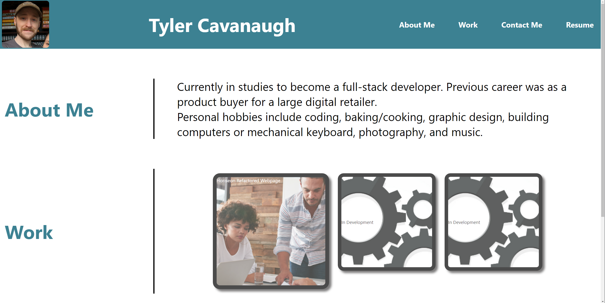
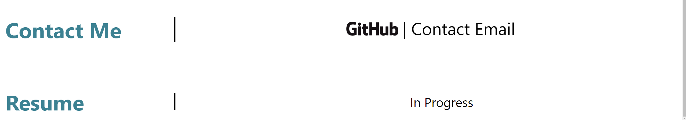

# Tyler Cavanaugh Portfolio Project

## Description

This portfolio was created to give a professional background/description of myself. 

- Built with HTML and CSS 

## Usage

Please use the navigation sections within the header (About Me, Work, Contact Me, and Resume) which allow you to skip right to the designated section you're looking for. I currently have only one project that is deployed, but will add more to reference as I continue to program. 

The "In Development" boxes underneath the Work section do not lead to any link. Please do not click those. The resume is also not fully built and is a placeholder to add in the future.

Below you will see both the GitHub pages link as well as images that reference what the website currently looks like visually. 

https://tyler-cav.github.io/Work-Portfolio/

